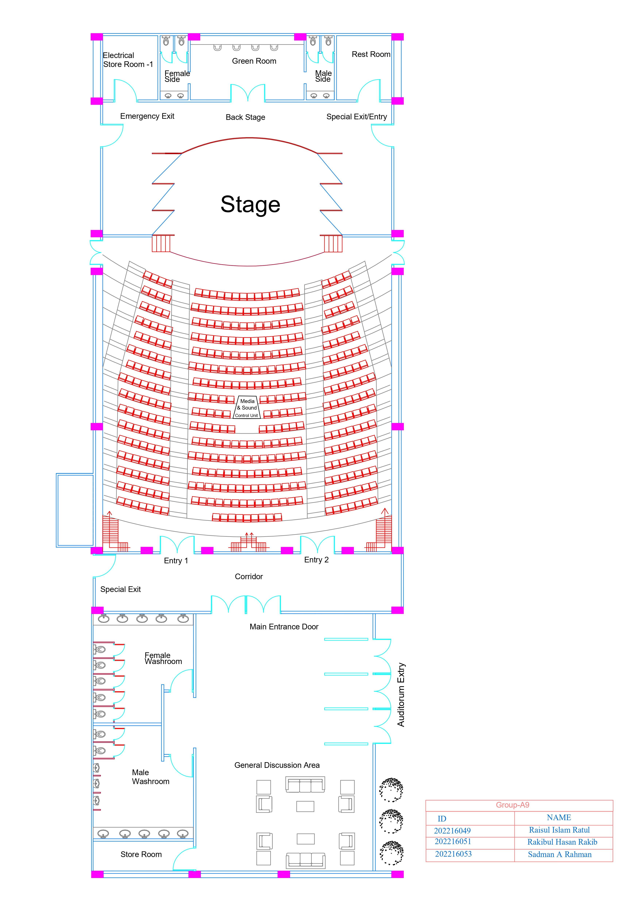
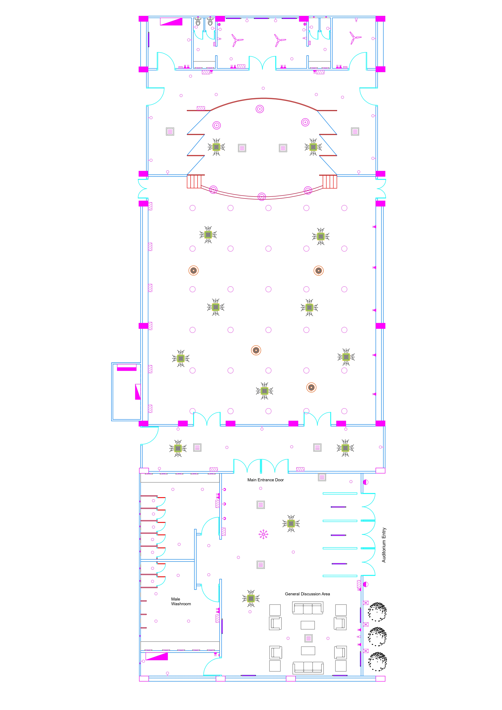
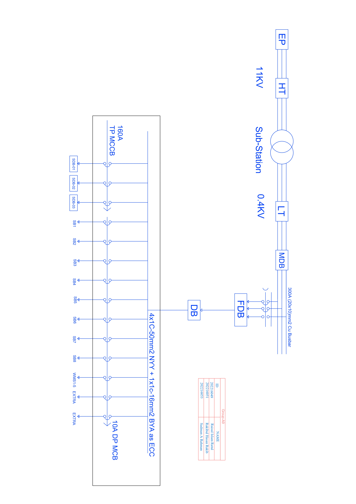
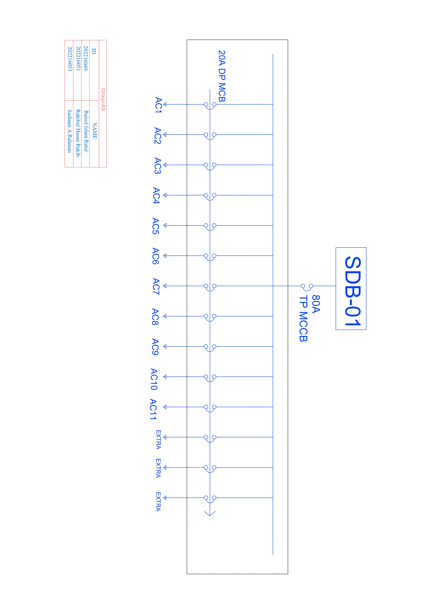
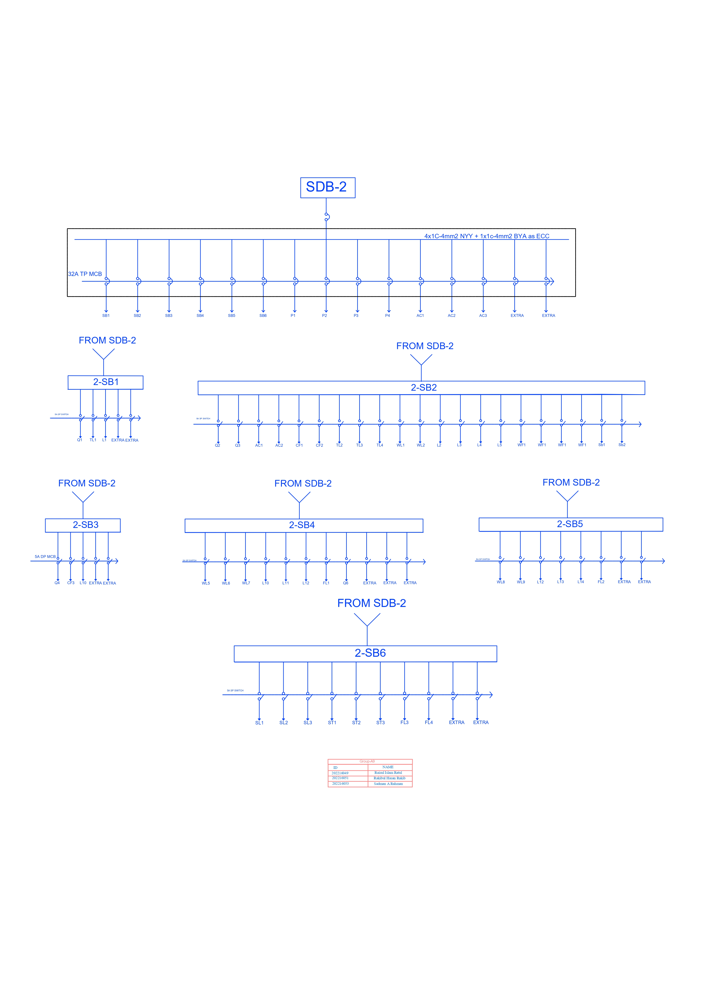
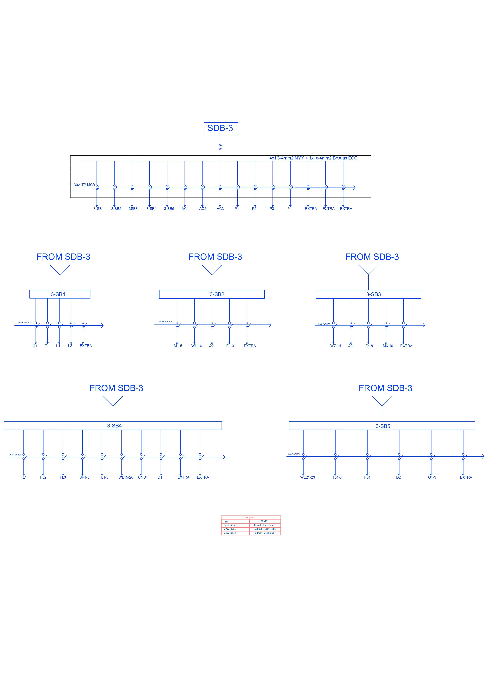
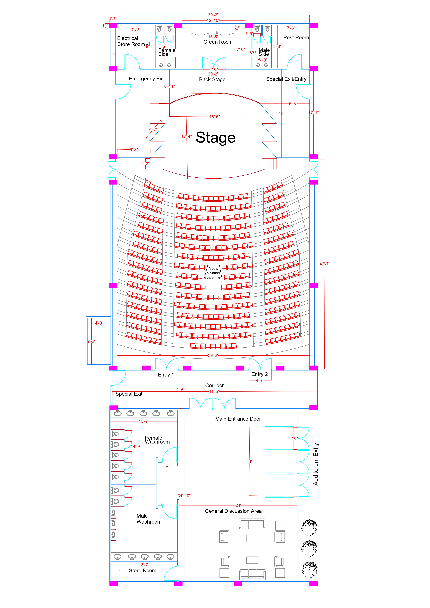

# Electrical Service Design & CAD Laboratory: Auditorium Layout & Electrical Design

This repository contains the complete CAD drawings, load calculations, illumination designs, and Bill of Quantities (BOQ) for the **Auditorium Electrical Service Design** project. The project was completed for the course **EECE-222: Electrical Service Design & CAD Laboratory** at the **Military Institute of Science and Technology (MIST)**.

---

## Project Presentation Video

  
   
  <strong>Click the logo above to watch the project presentation on YouTube.</strong>

---

## Group Details (Group A9)
* **Department:** Department of Electrical, Electronic, and Communication Engineering (EECE)
* **Institution:** Military Institute of Science and Technology (MIST)
* **Course Code & Title:** EECE-222: Electrical Service Design & CAD Laboratory
* **Date of Submission:** December 2, 2023

### Team Members
| Name | Student ID |
| :--- | :--- |
| **Md. Raisul Islam Ratul** | 202216049 |
| **Md. Rakibul Hasan** | 202216051 |
| **Md. Sadman-A-Rahman** | 202216053 |

---

## Project Overview & Specifications

This project designs a comprehensive electrical system for a modern single-story **Auditorium** spanning **5,000 square feet**. The design prioritizes acoustic clarity, visual comfort, safety, energy efficiency, and cost-effectiveness. 

### Floor Plan Segments
The auditorium is divided into four main functional segments:
1. **Main Hall (Audience Seating):** Length = 43 ft, Width = 39 ft. Designed for optimal seating line-of-sight and superior acoustics.
2. **Stage Area:** Features advanced spot and rotating stage lighting, sound systems, and backdrops.
3. **Back Stage:** Dedicated space for performers, equipped with separate air conditioning and dressing rooms.
4. **General Discussion & Entrance Lobby:** A welcoming, well-lit reception and circulation area for attendee interaction.

### Physical Dimensions
* **Total Length:** 114 ft 4 inches
* **Total Width:** 42 ft 3 inches
* **Main Hall Area:** 155.59 m² (Length = 39 ft 2 in / 11.89 m, Width = 42 ft 7 in / 13.11 m)
* **Ceiling/Mounting Height:** 10 m

---

## Technical Calculations & Wiring Specifications

The electrical system is fed from an onsite substation through a Main Distribution Board (MDB) which branches out to three Sub-Distribution Boards (SDBs) catering to specific zones and load types.

### 1. Main Distribution Board (MDB) Summary
* **Total Maximum Demand (SDB1 + SDB2 + SDB3):** 64,314.1 W
* **Maximum Demand (with 10% Spare):** 70,745.51 W
* **Calculated Current (I_demand):** 123.03 A 
* **Required Current capacity (with 25% Safety Factor):** 153.78 A
* **Circuit Breaker:** 160A Triple-Pole MCCB
* **Main Incoming Cable:** 4 × 1C-50 mm² NYY + 1 × 1C-16 mm² BYA (ECC)
* **Busbar Rating:** 300A Copper Busbar

---

### 2. Sub-Distribution Board Calculations

#### A. SDB-1: Air Conditioning Loads (Main Hall)
* **Primary Load:** Central Air Conditioning (11 × 3,000 W units)
* **Total Maximum Demand:** 33,000 W (With 10% spare: 36,300 W)
* **Calculated Current:** 63.13 A (With safety factor: 78.91 A)
* **Circuit Breaker:** 80A DP MCB
* **Cable:** 4 × 1C-25 mm² NYY + 1 × 1C-16 mm² BYA (ECC)
* **Busbar Size:** 160A

#### B. SDB-2: General Lighting, Power Sockets & Backstage AC
* **Total Maximum Demand:** 12,207.9 W (With 10% spare: 13,428.69 W)
* **Calculated Current:** 23.35 A (With safety factor: 29.19 A)
* **Circuit Breaker:** 32A DP MCB
* **Cable:** 4 × 1C-4 mm² NYY + 1 × 1C-4 mm² BYA (ECC)
* **Busbar Size:** 60A

**Load Breakdown:**
* **Lighting:** Flat LED (4 × 80 W), Mirror Light (4 × 15 W), Tube Light (5 × 40 W), Wall Bracket (16 × 40 W), Stage Spot Lights (3 × 800 W), Rotating Stage Lights (3 × 1500 W), Ceiling Light (8 × 40 W).
* **Ventilation:** Ceiling Fan (3 × 75 W), Wall Fan (2 × 45 W), Exhaust Fan (4 × 36 W).
* **Power Sockets:** 5A 2-Pin (6 × 300 W), 13A 3-Pin (5 × 1000 W).
* **AC Loads:** 1.5-Ton AC (2 × 1500 W).

#### C. SDB-3: Special Lighting, General Sockets & Lobby AC
* **Total Maximum Demand:** 11,762.2 W (With 10% spare: 12,938.42 W)
* **Calculated Current:** 22.50 A (With safety factor: 28.13 A)
* **Circuit Breaker:** 32A DP MCB
* **Cable:** 4 × 1C-4 mm² NYY + 1 × 1C-4 mm² BYA (ECC)
* **Busbar Size:** 300A

**Load Breakdown:**
* **Lighting:** Chandelier (1 × 400 W), Flat LED (4 × 80 W), Exhibition Spot Light (3 × 15 W), Mirror Light (10 × 15 W), Tube Light (8 × 40 W), Wall Bracket (2 × 40 W), Ceiling Light (23 × 40 W), Door Light (2 × 30 W), Security Light (1 × 50 W), Garden Light (3 × 40 W).
* **Power Sockets:** 5A 2-Pin (2 × 300 W), 13A 3-Pin (4 × 1000 W).
* **AC Loads:** Central AC (2 × 3000 W), 1.5-Ton AC (1 × 1500 W).
* **Ventilation:** Washroom Exhaust Fan (7 × 36 W).

---

## Illumination Design (Main Hall)

To achieve uniform visual comfort, the illumination of the Main Hall was calculated using the lumen method:

* **Required Illuminance (E):** 200 Lux
* **Maintenance Factor (mf):** 0.7
* **Utilization Factor (uf):** 0.6
* **Average Luminous Flux per Lamp (F):** 2600 lumens
* **Main Hall Area (A):** 155.59 m²
* **Mounting Height (Hm):** 10 m

$$\text{Total Flux Required } (\Phi) = \frac{E \times A}{mf \times uf} = \frac{200 \times 155.59}{0.7 \times 0.6} = 74,090.48\text{ lumens}$$

$$\text{Number of Lamps Required } (N) = \frac{\Phi}{F} = \frac{74,090.48}{2,600} \approx 28.5 \text{ (Rounded to 30)}$$

*A layout of **30 LED flat panels (6 rows × 5 columns)** was chosen to maintain symmetry and satisfy the illumination standard.*

---

## Bill of Quantities (BOQ) Summary

The total estimated cost for the electrical service installation is **7,852,250.78 BDT**. A summary of the major components is presented below:

| Item No. | Description / Material | Unit | Quantity | Unit Rate (BDT) | Total Cost (BDT) |
| :--- | :--- | :---: | :---: | :---: | :---: |
| **1** | Cable: 4 × 1C-50 mm² NYY (BRB) | Meter | 176 | 3,383.83 | 595,554.08 |
| **2** | Cable: 4 × 1C-25 mm² NYY (Bizli) | Meter | 1,250 | 2,116.40 | 2,645,500.00 |
| **3** | Cable: 4 × 1C-4 mm² NYY | Meter | 387 | 415.40 | 160,759.80 |
| **4** | ECC Cable: 1 × 1C-16 mm² BYA | Meter | 1,450 | 196.40 | 284,780.00 |
| **5** | Central AC Units (3 kW) | Each | 13 | 264,000.00 | 3,432,000.00 |
| **6** | 1.5-Ton AC Units | Each | 4 | 57,900.00 | 231,600.00 |
| **7** | Wall Mounted Speakers (600W) | Each | 5 | 14,000.00 | 70,000.00 |
| **8** | Stage Spot Lights (800W) | Each | 3 | 11,577.00 | 34,731.00 |
| **9** | Stage Rotating Lights (1,500W) | Each | 3 | 17,500.00 | 52,500.00 |
| **10** | Copper Busbar: 300A (20 × 10) mm² | Meter | 6 | 2,700.00 | 16,200.00 |
| **11** | Switchboard & Conduit Works | LS | - | - | 328,625.90 |
| | **TOTAL ESTIMATED BUDGET** | | | | **7,852,250.78 BDT** |

---

## CAD Drawing Gallery

### 1. Main Floor Plan
Detailed architectural layout of the Auditorium showing segments, seating alignments, backstage zones, and physical dimensions.

---

### 2. Fittings and Fixtures Layout
AutoCAD plotting of the precise placement of lights, fans, power sockets, ACs, and speaker layouts.

---

### 3. Conduit Layout
The conduit runs indicating path routings from SDBs to final terminals (color-coded for separation).

---

### 4. Substation and MDB Layout
Substation transformer (11kV/415V), PFI Plant, Generator, LT Switchgear room, and main incoming line to MDB.

---

### 5. Sub-Distribution Board Layouts (SDB1, SDB2, SDB3)
Wiring diagrams showing breakers, busbar, and outgoing feeds for SDB1 (AC), SDB2 (Stage & Dressing), and SDB3 (Lobby & Main Hall).

#### SDB1 - AC Load

#### SDB2 - Lighting and Sockets

#### SDB3 - Special Loads and Fans

---

### 6. Physical Dimensions & Measurements
Precision AutoCAD measurement lines for lengths, widths, and clearance margins.

